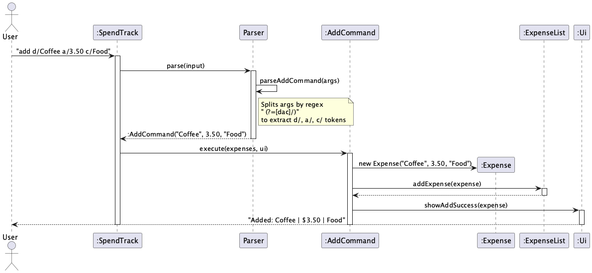
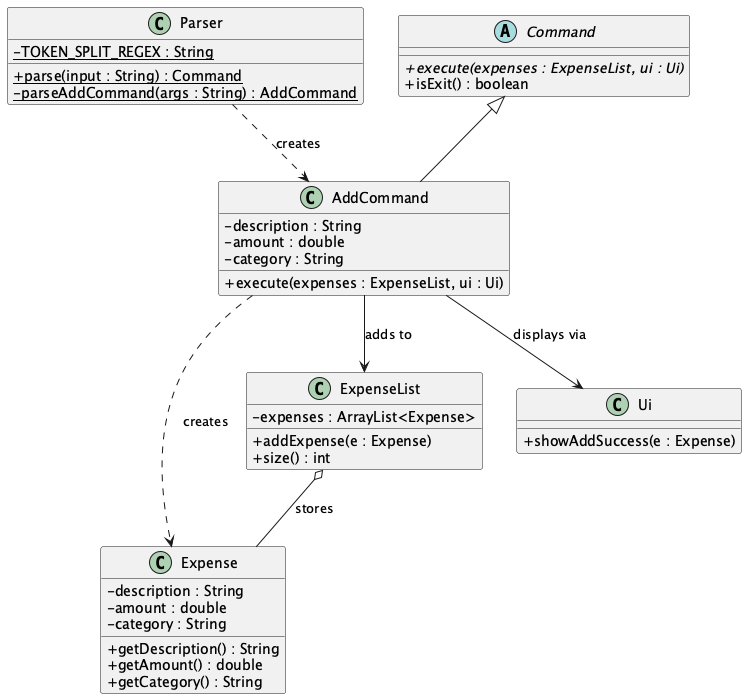

# Developer Guide

## Acknowledgements

No external libraries or reused code beyond the Java standard library.

## Design & Implementation

### Add Expense Feature

The add expense feature allows users to record a new expense with a description, amount, and category using the command:

```
add d/DESCRIPTION a/AMOUNT c/CATEGORY
```

#### How it works

The add mechanism follows the Command pattern used throughout SpendTrack. The following steps describe how an add command is processed:

1. The user enters `add d/Coffee a/3.50 c/Food`.
2. `SpendTrack.run()` passes the raw input to `Parser.parse()`.
3. `Parser.parse()` identifies the command word `add` and delegates to `Parser.parseAddCommand()`.
4. `parseAddCommand()` uses a regex lookahead `" (?=[dac]/)"` to split the arguments into tokens. Each token starts with a flag prefix (`d/`, `a/`, or `c/`), allowing the user to enter them in any order.
5. The extracted values are used to create a new `AddCommand` object.
6. `SpendTrack` calls `AddCommand.execute()`, which creates a new `Expense` and adds it to the `ExpenseList`.
7. `Ui.showAddSuccess()` displays a confirmation message to the user.

The following sequence diagram shows the full flow of the add command:



#### Design considerations

**Aspect: How to parse the flag-based input**

- **Alternative 1 (current):** Regex lookahead split `" (?=[dac]/)"`.
    - Pros: Users can type flags in any order (`a/3.50 d/Coffee c/Food` also works). Handles descriptions with spaces naturally since the split only occurs before a flag prefix.
    - Cons: The regex is less readable than simple string splitting.

- **Alternative 2:** Split by space and manually iterate.
    - Pros: Simpler to understand.
    - Cons: Breaks if the description contains spaces (e.g., `d/Bus fare` would be split incorrectly).

Alternative 1 was chosen because supporting spaces in descriptions is essential for a natural user experience.

**Aspect: Where to validate input**

Validation is split across two layers:
- `Parser` validates the format (e.g., amount is a valid number).
- `AddCommand` validates the values at runtime using assertions (e.g., amount is non-negative, parameters are not null).

This defence-in-depth approach ensures that even if one layer is bypassed during future refactoring, the other still catches invalid data.

#### Class structure

The following class diagram shows the relationships between the classes involved in the add command:



`Parser` creates `AddCommand` objects. `AddCommand` creates `Expense` objects and interacts with `ExpenseList` to store them. All concrete commands extend the abstract `Command` class, which defines the `execute()` method.

### [Proposed] Date Tagging Extension

In v2.0, the add command will support an optional `date/` parameter:

```
add d/Coffee a/3.50 c/Food date/2026-03-20
```

If omitted, the expense will be tagged with today's date using `LocalDate.now()`. This change requires:
- Adding a `LocalDate date` field to the `Expense` class.
- Extending `Parser.parseAddCommand()` to extract the optional `date/` token.
- Updating `Ui.showExpenseList()` to display the date column.

The date field is foundational for several planned features including filtering by date range, sorting by date, listing by month, and monthly spending reports.

## Product scope

### Target user profile

NUS students who want a fast, keyboard-driven way to track daily spending. The target user prefers typing commands over clicking through a GUI, is comfortable with a CLI, and wants to quickly log expenses on the go.

### Value proposition

SpendTrack helps students track expenses faster than a typical GUI app. Users can add, delete, list, and analyse expenses with short typed commands. Budget tracking and spending summaries help students stay within their means.

## User Stories

| Version | As a ... | I want to ... | So that I can ... |
|---------|----------|---------------|-------------------|
| v1.0 | new user | see usage instructions | refer to them when I forget how to use the application |
| v1.0 | student | add an expense with description, amount, and category | keep track of my spending |
| v1.0 | student | delete an expense by index | remove entries I added by mistake |
| v1.0 | student | list all my expenses | see everything I have spent |
| v1.0 | student | view the total of all expenses | know how much I have spent overall |
| v1.0 | student | set a monthly budget | control my spending |
| v1.0 | student | view my remaining balance | know how much I can still spend |
| v2.0 | student | tag expenses with a date | log past purchases I forgot to record |
| v2.0 | student | view a category breakdown | see where I am overspending |
| v2.0 | student | search expenses by keyword | find a specific purchase quickly |
| v2.0 | student | save and load expenses from file | keep my data between sessions |

## Non-Functional Requirements

1. Should work on any mainstream OS (Windows, macOS, Linux) with Java 17 installed.
2. Should respond to any command within 1 second.
3. A user with average typing speed should be able to log an expense faster than using a GUI app.
4. Data files should be human-readable plain text.

## Glossary

* *Expense* - A single spending entry with a description, amount, and category.
* *Budget* - A monthly spending limit set by the user.
* *Remaining balance* - The difference between the budget and total expenses.
* *Mutating command* - A command that changes the expense list (add, delete, edit).

## Instructions for manual testing

### Launch

1. Ensure Java 17 is installed.
2. Download the latest `spendtrack.jar` from the GitHub releases page.
3. Open a terminal, navigate to the folder containing the JAR, and run: `java -jar spendtrack.jar`

### Adding an expense

1. Type `add d/Coffee a/3.50 c/Food` and press Enter.
2. Expected: confirmation message showing the added expense.
3. Type `list` to verify the expense appears.

### Deleting an expense

1. Type `list` to see current expenses and their indices.
2. Type `delete 1` to remove the first expense.
3. Expected: confirmation showing the deleted expense.
4. Type `delete 999` to test out-of-range index.
5. Expected: error message showing the valid range.

### Setting a budget

1. Type `budget 500` to set a $500 budget.
2. Expected: confirmation showing budget, current total, and remaining.
3. Type `remaining` to verify the remaining balance.
4. Type `budget -10` to test negative amount.
5. Expected: error message.
